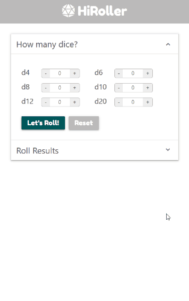

# HiRoller

&copy; Gina Lucy 2020

## Deployed

Deployed on GitHub Pages at https://grlucy.github.io/HiRoller/

## Description

A responsive app that simulates rolling dice with various numbers of sides. Users can select which type of dice to simulate (d4, d6, d8, d10, d12, d20) and how many of each type of dice to simulate. The app returns a random number for each simulated dice roll as well as the sum of all random numbers for each type of dice.

**Technologies Used:**

> HTML, CSS, Materialize, Sass, JavaScript, jQuery, Google Fonts, Font Awesome Icons

## Demo

